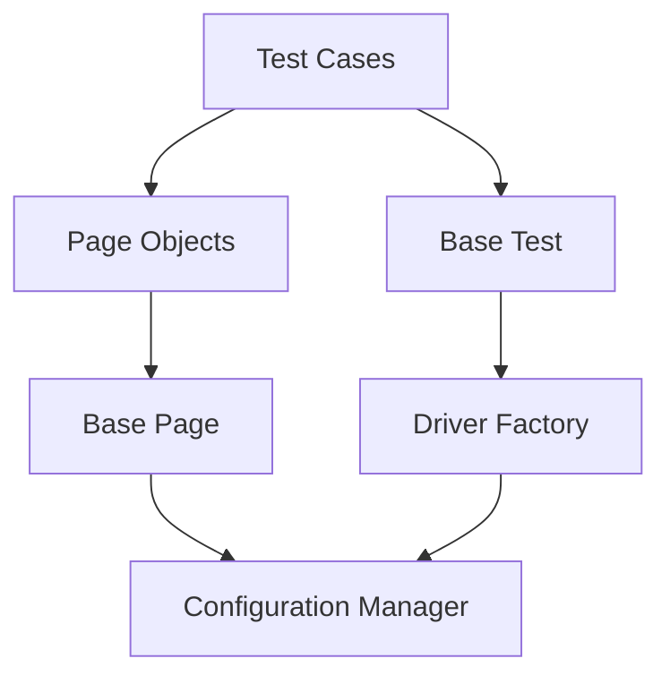
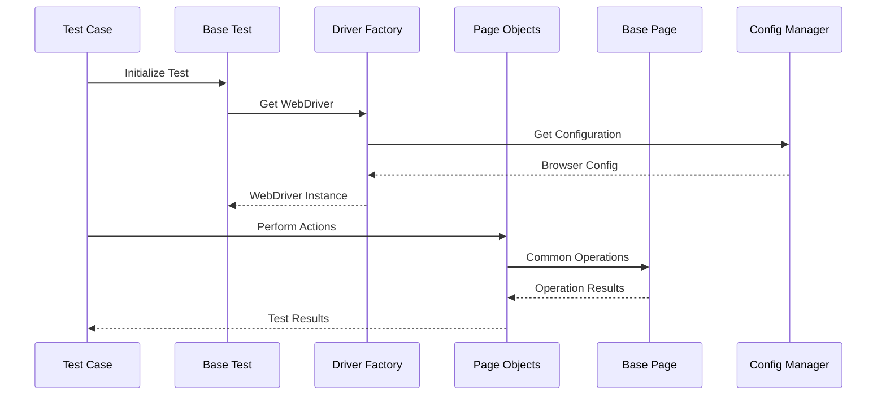

# Janitri Login Test Automation Framework

A robust test automation framework built using Selenium WebDriver, TestNG, and Java, implementing the Page Object Model (POM) design pattern for testing login functionality.

## Table of Contents
- [Project Overview](#project-overview)
- [Project Structure](#project-structure)
- [Architecture](#architecture)
- [Prerequisites](#prerequisites)
- [Setup Instructions](#setup-instructions)
- [Test Execution](#test-execution)
- [Test Reports](#test-reports)
- [Framework Features](#framework-features)

## Project Overview

This test automation framework is designed to automate login functionality testing using industry-standard tools and best practices. The framework follows the Page Object Model pattern for better maintainability and reusability of code.

## Project Structure

```
src/
├── main/java/com/janitri/
│   ├── config/
│   │   └── ConfigurationManager.java    # Handles test configuration
│   ├── pages/
│   │   ├── BasePage.java               # Contains common page operations
│   │   └── LoginPage.java              # Login page specific elements and actions
│   └── utils/
│       └── DriverFactory.java          # WebDriver initialization and management
└── test/java/com/janitri/
    └── tests/
        ├── BaseTest.java               # Test setup and teardown
        └── LoginTest.java              # Login test cases
```

## Architecture



## Framework Flow



## Prerequisites

- Java JDK 17 or higher
- Maven 3.8.x or higher
- Chrome Browser (latest version)
- ChromeDriver (compatible with your Chrome version)

## Setup Instructions

1. Clone the repository:
   ```bash
   git clone <repository-url>
   ```

2. Install dependencies:
   ```bash
   mvn clean install
   ```

3. Configure browser settings in `testng.xml`:
   ```xml
   <parameter name="browser" value="chrome"/>
   ```

## Test Execution

### Running Tests Using Maven

```bash
mvn clean test
```

### Running Specific Test Classes

```bash
mvn test -Dtest=LoginTest
```

### Running Through TestNG XML

```bash
mvn test -DsuiteXmlFile=testng.xml
```

## Test Coverage

The framework currently includes the following test scenarios:

1. **Login Button State Test**
   - Validates the default state of the login button
   - Test Method: `testLoginButtonEnabledByDefault()`

2. **Page Elements Verification**
   - Verifies the presence of all login page elements
   - Test Method: `testPageElementsPresence()`

3. **Password Field Functionality**
   - Tests password field masking/unmasking functionality
   - Test Method: `testPasswordMaskedButton()`

4. **Invalid Login Scenario**
   - Verifies error message display for invalid credentials
   - Test Method: `testInvalidLoginShowErrorMsg()`

## Test Reports

The framework generates detailed test reports in multiple formats:

- TestNG HTML Reports: `target/surefire-reports/index.html`
- Emailable Report: `target/surefire-reports/emailable-report.html`
- XML Reports: `target/surefire-reports/testng-results.xml`

## Framework Features

- **Page Object Model**: Enhances test maintenance and reduces code duplication
- **Configuration Management**: Externalized configuration for different environments
- **Browser Factory**: Centralized WebDriver management
- **Base Page Object**: Common web element operations and waits
- **Test Base**: Common test setup and teardown operations
- **TestNG Integration**: Test configuration, parallel execution, and reporting
- **Maven Integration**: Build and dependency management

## Contributing

Please read [CONTRIBUTING.md](CONTRIBUTING.md) for details on our code of conduct and the process for submitting pull requests.

## Authors

- Your Name - *Initial work* - [YourGithub](https://github.com/yourusername)

## License

This project is licensed under the MIT License - see the [LICENSE.md](LICENSE.md) file for details